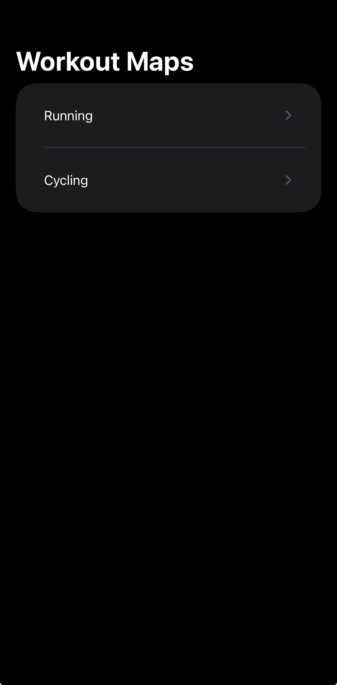
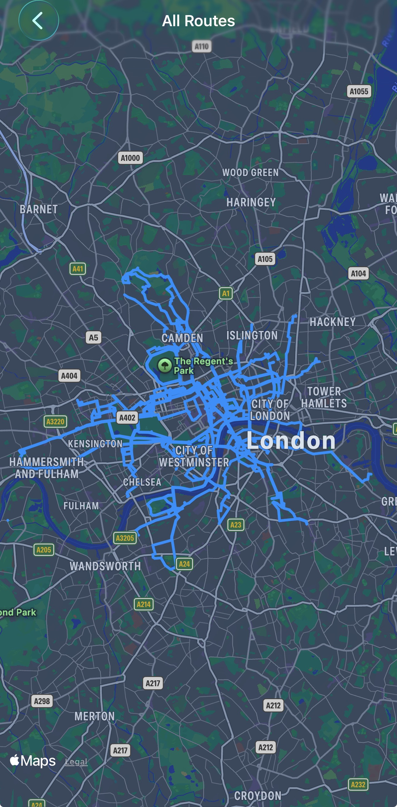

# MotionMaps
MotionMaps is an iOS app that visualizes all your cycling and running routes on a cumulative map, helping you track coverage across a city or globally.

## Authors
- [@ninapeire](https://www.github.com/ninapeire)

## Installation
1. Clone the repository: `git clone https://github.com/ninapeire/MotionMaps.git`
2. Open `MotionMaps.xcodeproj` in Xcode
3. Build and run on iPhone simulator or connected device

## Requirements
- Xcode 15+
- iOS 17+
- Swift 5.9+

## Tech Stack
- Swift & SwiftUI
- CoreLocation & MapKit for route tracking and visualization
- HealthKit integration (if used for running/cycling data)

## Screenshots
Home Screen:

Route Overlay:

