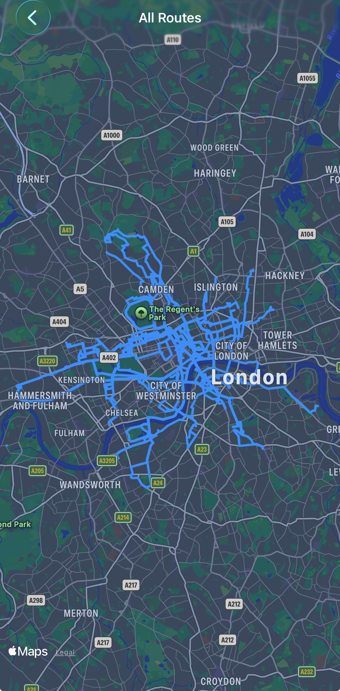

# MotionMaps

> Visualise every workout route you've recorded — overlaid on a single map.

MotionMaps is an iOS app that pulls cycling and running routes from Apple Health and overlays them on a MapKit view, so you can see exactly which streets, parks, and corners of your city you've already covered — and which you haven't.

<p align="center">
  
  
</p>

## Features

- Cumulative map of every cycling route
- Cumulative map of every running route
- Pure MapKit polyline rendering — fast and battery-friendly
- Read-only HealthKit access; no data ever leaves the device

## Tech Stack

- **Swift / SwiftUI** — declarative UI, `@StateObject`-driven view model
- **HealthKit** — `HKSampleQuery` for workouts, `HKWorkoutRouteQuery` for `CLLocation` series
- **MapKit + CoreLocation** — `MKPolyline` overlays inside a `UIViewRepresentable` wrapper around `MKMapView`

## Requirements

- Xcode 16+
- iOS 18.2+
- An iPhone signed into iCloud with recorded cycling or running workouts. The app currently shows workouts from October 2024 onward.

## Getting Started

```bash
git clone https://github.com/ninapeire/MotionMaps.git
cd MotionMaps
open MotionMaps.xcodeproj
```

Build and run on either:

- **An iPhone simulator** — useful for UI checks; no real workouts to render
- **A connected iPhone** — full app behaviour; you'll be prompted for HealthKit read access on first launch

## Architecture

| Layer       | Type                  | Responsibility                                                        |
| ----------- | --------------------- | --------------------------------------------------------------------- |
| Entry       | `MotionMapsApp`       | `@main` — sets up the `WindowGroup`                                   |
| Navigation  | `ContentView`         | Top-level list; surfaces Running / Cycling rows when data is present  |
| Data        | `HealthManager`       | Owns `HKHealthStore`; requests auth and runs the workout/route queries |
| Map (combined) | `CombinedRouteMapView` + `MultiRouteMap` | Draws every fetched route as a polyline on one `MKMapView` |
| Map helpers | `ColoredPolyline`     | `MKPolyline` subclass carrying its own stroke colour                  |

## Roadmap

- [ ] Per-workout drill-down (tap a row → see one route + start/end pins)
- [ ] Configurable date window (currently hardcoded to Oct 2024 onward)
- [ ] Auto-zoom to fit all routes instead of defaulting to central London
- [ ] Walking workouts
- [ ] Heatmap rendering for high-traffic streets
- [ ] Per-activity colour theming via `ColoredPolyline`

## Author

[@ninapeire](https://github.com/ninapeire) — Nina Peire

## License

[MIT](LICENSE)
